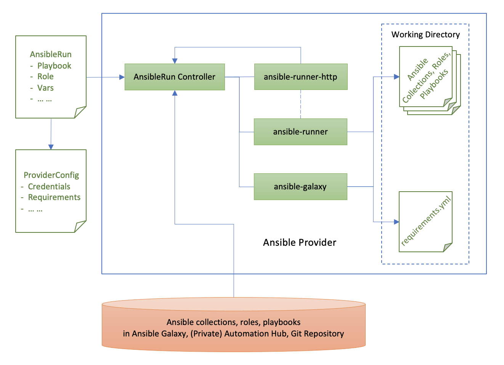
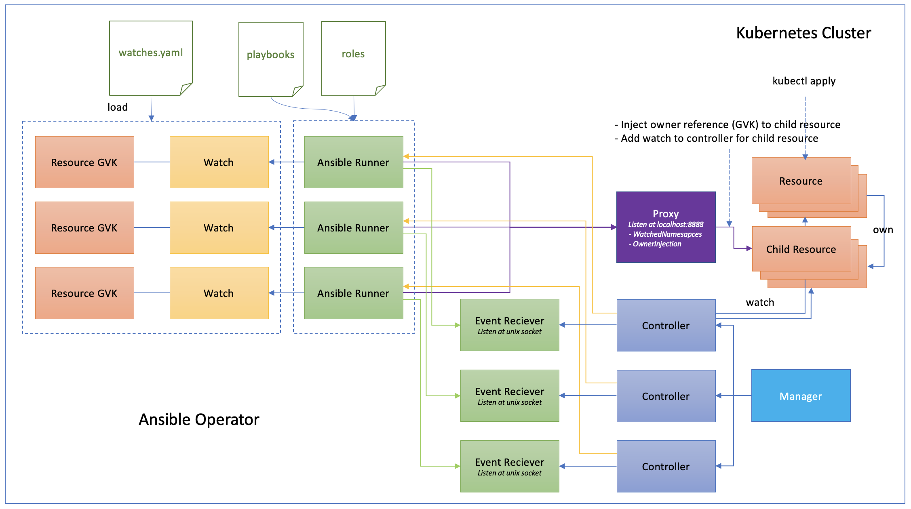

<!-- START doctoc generated TOC please keep comment here to allow auto update -->
<!-- DON'T EDIT THIS SECTION, INSTEAD RE-RUN doctoc TO UPDATE -->
**Table of Contents**  *generated with [DocToc](https://github.com/thlorenz/doctoc)*

- [The Design of Crossplane Provider for Ansible](#the-design-of-crossplane-provider-for-ansible)
  - [Overview](#overview)
  - [How It Works](#how-it-works)
    - [Working Directory](#working-directory)
  - [Supported Sources](#supported-sources)
    - [Inline](#inline)
    - [Remote](#remote)
  - [Requirements Declaration](#requirements-declaration)
  - [Supported Ansible Contents](#supported-ansible-contents)
  - [Passing Vars](#passing-vars)
  - [AnsibleRun Lifecycle](#ansiblerun-lifecycle)
  - [Comparing with Ansible Operator](#comparing-with-ansible-operator)
  - [More Considerations](#more-considerations)

<!-- END doctoc generated TOC please keep comment here to allow auto update -->

# The Design of Crossplane Provider for Ansible

## Overview

Crossplane is often used to assemble infrastructure from multiple vendors declaratively in Kubernetes which is a typical cloud native architecture. However, this may not be true for many real-world organizations who may have many IT systems that are traditional based and have invested heavily on management automation for these systems.

Ansible, as a popular automation technology, has a large user base and mature eco-system. It is widely adopted by many organizations to automate management for different varieties of IT systems, ranging from cloud native to non cloud native.

The Crossplane provider for Ansible is targeted to extend the Crossplane scope by enabling its integration with Ansible to build a bridge between the cloud native and non cloud native worlds, open the door to drive and reuse existing automation assets, no matter it is cloud native or non cloud native, to manage hybrid technologies using the same way consistently and help organizations transition to cloud native while keep their existing investments.

## How It Works

The high level architecture for Ansible provider is illustrated as below.



Ansible provider uses Kubernetes resource `AnsibleRun` to represent a certain Ansible run, e.g.: to run a set of Ansible roles or playbooks. The `AnsibleRun` resource also refers to a `ProviderConfig` resource including all information at provider level that are needed to support Ansible runs, e.g.: credentials needed to access a remote place that hosts Ansible contents, requirements needed to install as prerequisite before run Ansible contents. Regarding the Ansible contents, it can be collections, roles, or playbooks that are hosted in Ansible Galaxy, public or private Automation Hub, or GitHub repository.

As the managed resource of Ansible provider, once the `AnsibleRun` resource is defined, the provider will download the Ansible contents into the provider working directory first via the method `Connect()` in AnsibleRun controller, then trigger the Ansible run according to the provider lifecycle via method `Observe()/Create()/Update()/Delete()`. 

Inside the provider, it actually relies on the command line tool [`ansible-galaxy`](https://docs.ansible.com/ansible/latest/cli/ansible-galaxy.html) to download Ansible contents, then use [`ansible-runner`](https://ansible-runner.readthedocs.io/) to execute them. The module [`ansible-runner-http`](https://github.com/ansible/ansible-runner-http) is a plugin for ansible runner that allows to emit Ansible status and events to HTTP services in the form of POST events, so as to notify AnsibleRun controller about the run results and attatch that to `AnsibleRun` as status.

### Working Directory

The provider working directory is used to host the Ansible contents downloaded from remote place. It is currently inside the provider container so that will not be persisted permanently by the provider. As a result, when the provider pod restarts, the contents will be lost, but the provider will download them from remote place again.

## Supported Sources

There are two types of sources from which the Ansible contents can be retrieved, installed and run by Crossplane Provider for Ansible (or Ansible provider for short).

### Inline

This is maily for quick test. You can inline the Ansible content to be run in an `AnsibleRun` resource. It will be wrapped as a `playbook.yml` file and stored in the working directory for the provider to run.

Here is an example to call a builtin Ansible module:

```yaml
apiVersion: ansible.crossplane.io/v1alpha1
kind: AnsibleRun
metadata:
  name: inline-example
spec:
  forProvider:
    # For simple cases, you can use an inline source to specify the content of
    # playbook.yml as opaque and inline yaml.
    playbookInline: |
      ---
      - hosts: localhost
        tasks:
          - name: simple-playbook
            debug:
              msg: You are running 'simple-playbook'
  providerConfigRef:
    name: provider-config-example
```

### Remote

This is more useful for a real project where Ansible contents are hosted in a remote place. The Ansible contents can be retrieved from [Ansible Galaxy](https://galaxy.ansible.com/) as community contents, or Automation Hub as Red Hat certified and supported contents, or a private Automation Hub that hosts private contents created and curated by an organization, or even a GitHub repository.

Here is an example to run one Ansible role. If multiple roles are listed, they will be run sequencially one after another. 

```yaml
apiVersion: ansible.crossplane.io/v1alpha1
kind: AnsibleRun
metadata:
  name: remote-example
spec:
  forProvider:
    roles:
      - sample_namespace.sample_role
  providerConfigRef:
    name: provider-config-example
```

By default, the roles being referenced will be retrieved from Ansible Galaxy. This is identical to run `ansible-galaxy` from command line as below:

```shell
ansible-galaxy role install sample_namespace.sample_role
```

To retrieve Ansible contents from places other than Ansible Galaxy, please refer to [Requirements Declaration](#requirements-declaration).

## Requirements Declaration

The Ansible provider supports to retrieve Ansible contents from different places including Ansible Galaxy, public or private Automation Hub, and GitHub repository. This can be configured by declaring `requirements` in `ProviderConfig` resource. The requirements definition will be wrapped as a `requirements.yml` file and stored in the working directory for the provider to consume.

Here is an example to retrieve an Ansible collection from Ansible Galaxy:

```yaml
apiVersion: ansible.crossplane.io/v1alpha1
kind: ProviderConfig
metadata:
  name: provider-config-example
spec:
  requirements: |
    ---
    collections:
      # Install a collection from Ansible Galaxy.
      - name: sample_namespace.sample_collection
        version: 0.1.0
        source: https://galaxy.ansible.com
```

This is identical to run `ansible-galaxy` from command line as below:

```shell
ansible-galaxy install -r requirements.yml
```

To retrieve Ansible contents from GitHub repository:

```yaml
apiVersion: ansible.crossplane.io/v1alpha1
kind: ProviderConfig
metadata:
  name: provider-config-example
spec:
  requirements: |
    ---
    collections:
      # Install a collection from GitHub repository.
      - name: https://github.com/sample_namespace/sample_collection.git
        version: 0.1.0
        type: git
```

To retrieve Ansible contents from Automation Hub or private GitHub repository that requires credentials, this can be configured by declaring `credentials` in `ProviderConfig`.

Here is an example to retrieve an Ansible collection from a private GitHub repository using git credentials:

```yaml
apiVersion: ansible.crossplane.io/v1alpha1
kind: ProviderConfig
metadata:
  name: provider-config-example
spec:
  credentials:
    - filename: .git-credentials
      source: Secret
      secretRef:
        namespace: crossplane-system
        name: git-credentials
        key: .git-credentials
  requirements: |
    ---
    collections:
      # Install a collection from GitHub repository.
      - name: https://github.com/sample_namespace/sample_collection.git
        version: 0.1.0
        type: git
```

It requires to create a secret `git-credentials` including the credentials and is referenced in `ProviderConfig` as above.

Besides Ansible collections, you can also define Ansible roles as requirements in `ProviderConfig`. For example, you can define both roles and collections in the same `ProviderConfig` resource as below:

```yaml
apiVersion: ansible.crossplane.io/v1alpha1
kind: ProviderConfig
metadata:
  name: provider-config-example
spec:
  requirements: |
    ---
    roles:
      # Install a role from Ansible Galaxy.
      - name: sample_namespace.sample_role
        version: 0.1.0
    collections:
      # Install a collection from Ansible Galaxy.
      - name: sample_namespace.sample_collection
        version: 0.1.0
        source: https://galaxy.ansible.com
```

## Supported Ansible Contents

Ansible provider supports to run different types of Ansible contents, including roles and playbooks, using `AnsibleRun`. You can not define playbooks and roles in the same `AnsibleRun` resource. They are mutually exclusive.

You have already seen how to run Ansible role and inline playbook. Here is an example to run an Ansible playbook that is included in a collection. If multiple playbooks are listed, they will be run sequencially one after another.

```yaml
apiVersion: ansible.crossplane.io/v1alpha1
kind: AnsibleRun
metadata:
  name: remote-example
spec:
  forProvider:
    playbooks:
      - sample_namespace.sample_collection.sample_playbook
  providerConfigRef:
    name: provider-config-example
```

The collection that includes the playbook is defined as a requirement in `ProviderConfig` and  retrieved from a remote place.

When using inline playbook, besides builtin Ansible modules, you can also include roles or playbooks from collections that are defined as requirements in `ProviderConfig` and retrieved from remote place. For example, below inline playbook is to call `nginx` role in `nginxinc.nginx_core` collection:

```yaml
apiVersion: ansible.crossplane.io/v1alpha1
kind: AnsibleRun
metadata:
  name: inline-example
spec:
  forProvider:
    playbookInline: |
      ---
      - hosts: all
        collections:
          - nginxinc.nginx_core
        tasks:
          - name: Install NGINX
            include_role:
              name: nginx
  providerConfigRef:
    name: provider-config-example
```

The corresponding collection is defined as requirement in `ProviderConfig`:

```yaml
apiVersion: ansible.crossplane.io/v1alpha1
kind: ProviderConfig
metadata:
  name: example
spec:
  requirements: |
    ---
    collections:
      - name: nginxinc.nginx_core
        version: 0.5.0
```

## Passing Vars

(WIP) Define the way to pass vars into Ansible run for user-defined settings.

## AnsibleRun Lifecycle

(WIP) Define the way to bind Ansible run to the provider lifecycle methods, e.g.: how to use check or diff in method `Observe()`.

## Comparing with Ansible Operator

(WIP) Understand how Ansible Operator works and compare it with Ansible provider to figure out the difference.



## More Considerations

* (WIP) How Inventory is applied?
* (WIP) Use case: How Ansible provider helps Argo CD to GitOpsify everything?
* ...
