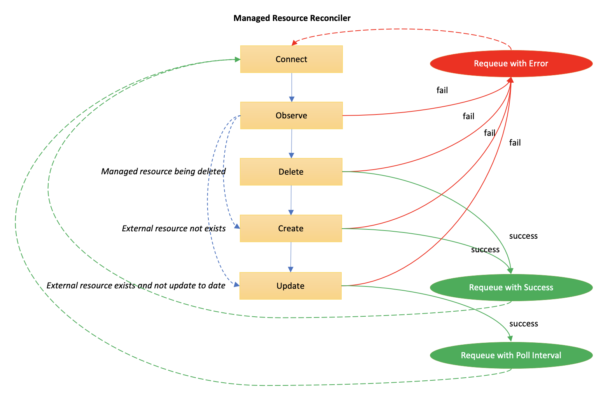
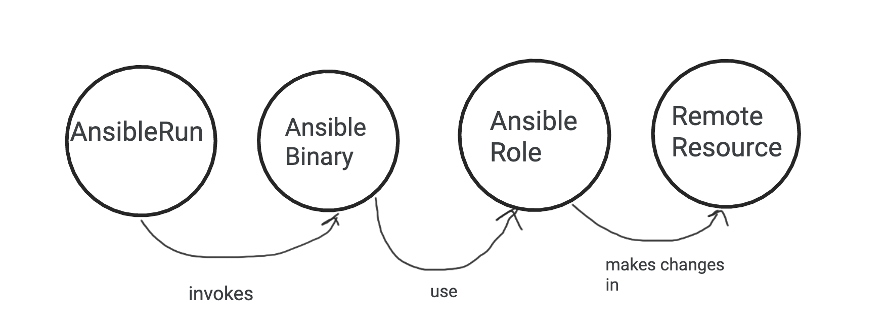
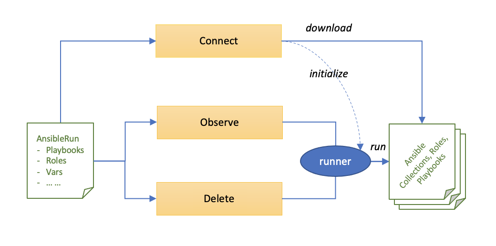
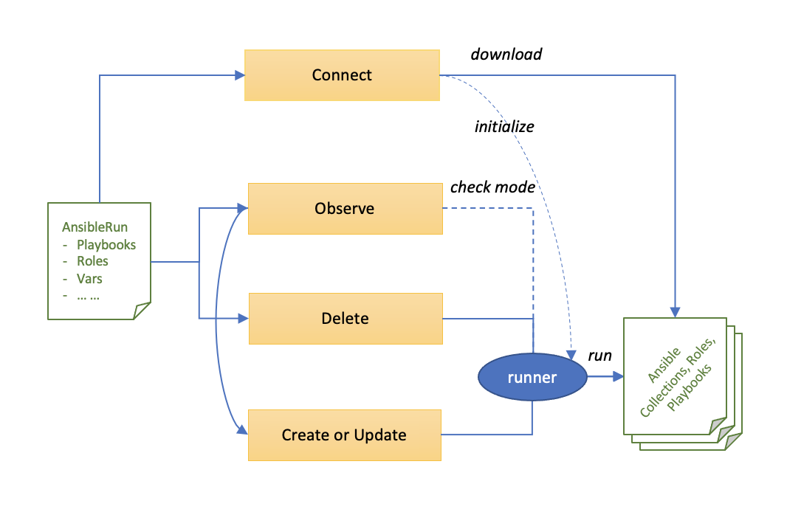

<!-- START doctoc generated TOC please keep comment here to allow auto update -->
<!-- DON'T EDIT THIS SECTION, INSTEAD RE-RUN doctoc TO UPDATE -->
**Table of Contents**  *generated with [DocToc](https://github.com/thlorenz/doctoc)*

- [The Design of Crossplane Provider for Ansible](#the-design-of-crossplane-provider-for-ansible)
  - [Overview](#overview)
  - [How It Works](#how-it-works)
    - [Working Directory](#working-directory)
  - [Supported Sources](#supported-sources)
    - [Inline](#inline)
    - [Remote](#remote)
  - [Requirements Declaration](#requirements-declaration)
  - [Supported Ansible Contents](#supported-ansible-contents)
  - [Passing Variables](#passing-variables)
    - [Passing Variables via ProviderConfig](#passing-variables-via-providerconfig)
  - [AnsibleRun Lifecycle](#ansiblerun-lifecycle)
    - [Resource Management Lifecycle](#resource-management-lifecycle)
    - [Mapping Ansible Run to Resource Management Lifecycle](#mapping-ansible-run-to-resource-management-lifecycle)
    - [Preparing Ansible Contents](#preparing-ansible-contents)
    - [Ansible Run Policy](#ansible-run-policy)
      - [Policy ObserveAndDelete](#policy-observeanddelete)
      - [Policy CheckWhenObserve](#policy-checkwhenobserve)
      - [Why Using Annotation](#why-using-annotation)
    - [Best Practices to Write Ansible Contents](#best-practices-to-write-ansible-contents)
      - [Writing Idempotent Roles or Playbooks](#writing-idempotent-roles-or-playbooks)
      - [Running Roles or Playbooks Per State](#running-roles-or-playbooks-per-state)
  - [Comparing with Ansible Operator](#comparing-with-ansible-operator)
    - [Difference between Ansible Provider and Ansible Operator](#difference-between-ansible-provider-and-ansible-operator)
  - [Appendix: Feature List](#appendix-feature-list)

<!-- END doctoc generated TOC please keep comment here to allow auto update -->

# The Design of Crossplane Provider for Ansible

## Overview

Crossplane is often used to assemble infrastructure from multiple vendors declaratively in Kubernetes which is a typical cloud native architecture. However, this may not be true for many real-world organizations who have many IT systems that are traditional based and have invested heavily on management automation for these systems.

Ansible, as a popular automation technology, has a large user base and mature eco-system. It is widely adopted by many organizations to automate management for different varieties of IT systems, ranging from cloud native to non cloud native.

The Crossplane provider for Ansible (or Ansible provider for short) is targeted to extend the Crossplane scope by enabling its integration with Ansible to build a bridge between the cloud native and non cloud native worlds, open the door to drive and reuse existing automation assets, no matter it is cloud native or non cloud native, to manage hybrid technologies using the same way consistently and help organizations transition to cloud native while keep their existing investments.

## How It Works

The high level architecture for Ansible provider is illustrated as below.


Ansible provider uses Kubernetes resource `AnsibleRun` to represent a certain Ansible run, e.g.: to run a set of Ansible roles or playbooks. The `AnsibleRun` resource also refers to a `ProviderConfig` resource including all information at provider level that are needed to support Ansible runs, e.g.: credentials needed to access a remote place that hosts Ansible contents, requirements needed to install as prerequisite before run Ansible contents. Regarding the Ansible contents, it can be collections, roles, or playbooks that are hosted in Ansible Galaxy, public or private Automation Hub, or GitHub repository.

As the managed resource of Ansible provider, once an `AnsibleRun` resource is defined, the provider will download the Ansible contents specified in that resource into the provider working directory via the method `Connect()` in AnsibleRun controller, then trigger the Ansible run according to the provider lifecycle via below methods defined in the controller:

| Method      | Description
|:------------|:------------
| `Observe()` | Detect if it needs to perform create, update, or delete by comparing the actual state in target system and the desired state defined in `AnsibleRun` resource.
| `Create()`  | Create something on target system by running Ansible contents.
| `Update()`  | Update something on target system by running Ansible contents.
| `Delete()`  | Delete something from target system by running Ansible contents.

Inside the provider, it actually relies on the command line tool [`ansible-galaxy`](https://docs.ansible.com/ansible/latest/cli/ansible-galaxy.html) to download Ansible contents, then use [`ansible-runner`](https://ansible-runner.readthedocs.io/) to execute them. The module [`ansible-runner-http`](https://github.com/ansible/ansible-runner-http) is a plugin for ansible runner that allows to emit Ansible status and events to HTTP services in the form of POST events, so as to notify AnsibleRun controller about the run results and attatch that to `AnsibleRun` as status.

### Working Directory

The provider working directory is used to host the Ansible contents downloaded from remote place. It is currently inside the provider container so that will not be persisted permanently by the provider. As a result, when the provider pod restarts, the contents will be lost, but the provider will download them from remote place again.

## Supported Sources

There are two types of sources from which the Ansible contents can be retrieved, installed and run by Ansible provider.

### Inline

This is maily for quick test. You can inline the Ansible content to be run in an `AnsibleRun` resource. It will be wrapped as a `playbook.yml` file and stored in the working directory for the provider to run.

Here is an example to use an inline playbook to call a builtin Ansible module:

```yaml
apiVersion: ansible.crossplane.io/v1alpha1
kind: AnsibleRun
metadata:
  name: inline-example
spec:
  forProvider:
    # For simple cases, you can use an inline source to specify the content of
    # playbook.yml as opaque and inline yaml.
    playbookInline: |
      ---
      - hosts: localhost
        tasks:
          - name: simple-playbook
            debug:
              msg: You are running 'simple-playbook'
  providerConfigRef:
    name: provider-config-example
```

### Remote

This is more useful for a real project where Ansible contents are hosted in a remote place. The Ansible contents can be retrieved from [Ansible Galaxy](https://galaxy.ansible.com/) as community contents, or Automation Hub as Red Hat certified and supported contents, or a private Automation Hub that hosts private contents created and curated by an organization, or even a GitHub repository.

Here is an example to run an Ansible role that is included in a collection, using `spec.forProvider.role`:

```yaml
apiVersion: ansible.crossplane.io/v1alpha1
kind: AnsibleRun
metadata:
  name: remote-example
spec:
  forProvider:
    role: sample_namespace.sample_role
  providerConfigRef:
    name: provider-config-example
```

If multiple roles are listed using `spec.forProvider.roles`, they will be run sequencially one after another. At the time of writing this document, only single role execution is supported.

```yaml
apiVersion: ansible.crossplane.io/v1alpha1
kind: AnsibleRun
metadata:
  name: remote-example
spec:
  forProvider:
    roles:
      - sample_namespace.sample_role
      - sample_namespace.another_sample_role
  providerConfigRef:
    name: provider-config-example
```


By default, the roles being referenced will be retrieved from Ansible Galaxy. This is identical to run `ansible-galaxy` from command line as below:

```shell
ansible-galaxy role install sample_namespace.sample_role
```

To retrieve Ansible contents from other places, please refer to [Requirements Declaration](#requirements-declaration).

## Requirements Declaration

The Ansible provider supports to retrieve Ansible contents from different places including Ansible Galaxy, public or private Automation Hub, and GitHub repository. This can be configured by declaring `requirements` in `ProviderConfig` resource. The requirements definition will be wrapped as a `requirements.yml` file and stored in the working directory for the provider to consume.

Here is an example to retrieve an Ansible collection from Ansible Galaxy:

```yaml
apiVersion: ansible.crossplane.io/v1alpha1
kind: ProviderConfig
metadata:
  name: provider-config-example
spec:
  requirements: |
    ---
    collections:
      # Install a collection from Ansible Galaxy.
      - name: sample_namespace.sample_collection
        version: 0.1.0
        source: https://galaxy.ansible.com
```

This is identical to run `ansible-galaxy` from command line as below:

```shell
ansible-galaxy install -r requirements.yml
```

To retrieve Ansible contents from GitHub repository:

```yaml
apiVersion: ansible.crossplane.io/v1alpha1
kind: ProviderConfig
metadata:
  name: provider-config-example
spec:
  requirements: |
    ---
    collections:
      # Install a collection from GitHub repository.
      - name: https://github.com/sample_namespace/sample_collection.git
        version: 0.1.0
        type: git
```

To retrieve Ansible contents from Automation Hub or private GitHub repository that requires credentials, this can be configured by declaring `credentials` in `ProviderConfig`.

Here is an example to retrieve an Ansible collection from a private GitHub repository using git credentials:

```yaml
apiVersion: ansible.crossplane.io/v1alpha1
kind: ProviderConfig
metadata:
  name: provider-config-example
spec:
  credentials:
    - filename: .git-credentials
      source: Secret
      secretRef:
        namespace: crossplane-system
        name: git-credentials
        key: .git-credentials
  requirements: |
    ---
    collections:
      # Install a collection from GitHub repository.
      - name: https://github.com/sample_namespace/sample_collection.git
        version: 0.1.0
        type: git
```

It requires to create a secret `git-credentials` including the credentials and is referenced in `ProviderConfig` as above.

Besides Ansible collections, you can also define Ansible roles as requirements in `ProviderConfig` and you can define both roles and collections in the same `ProviderConfig` resource. For example:

```yaml
apiVersion: ansible.crossplane.io/v1alpha1
kind: ProviderConfig
metadata:
  name: provider-config-example
spec:
  requirements: |
    ---
    roles:
      # Install a role from Ansible Galaxy.
      - name: sample_namespace.sample_role
        version: 0.1.0
    collections:
      # Install a collection from Ansible Galaxy.
      - name: sample_namespace.sample_collection
        version: 0.1.0
        source: https://galaxy.ansible.com
```

## Supported Ansible Contents

Ansible provider supports running different types of Ansible contents using `AnsibleRun`, including roles and playbooks. You can not define roles and playbooks in the same `AnsibleRun` resource. They are mutually exclusive.

You have already seen how to run Ansible role and inline playbook. Here is an example to run an Ansible playbook that is included in a collection, using `spec.forProvider.playbook`:

```yaml
apiVersion: ansible.crossplane.io/v1alpha1
kind: AnsibleRun
metadata:
  name: remote-example
spec:
  forProvider:
    playbook: sample_namespace.sample_collection.sample_playbook
  providerConfigRef:
    name: provider-config-example
```

If multiple playbooks are listed using `spec.forProvider.playbooks`, they will be run sequencially one after another. At the time of writing this document, only single playbook execution is supported.

```yaml
apiVersion: ansible.crossplane.io/v1alpha1
kind: AnsibleRun
metadata:
  name: remote-example
spec:
  forProvider:
    playbooks:
      - sample_namespace.sample_collection.sample_playbook
      - sample_namespace.sample_collection.another_sample_playbook
  providerConfigRef:
    name: provider-config-example
```

The collection that includes the playbook is defined as a requirement in `ProviderConfig` and  retrieved from a remote place.

When using inline playbook, besides builtin Ansible modules, you can also include roles or playbooks from collections that are defined as requirements in `ProviderConfig` and retrieved from remote place. For example, below inline playbook is to call `nginx` role in `nginxinc.nginx_core` collection:

```yaml
apiVersion: ansible.crossplane.io/v1alpha1
kind: AnsibleRun
metadata:
  name: inline-example
spec:
  forProvider:
    playbookInline: |
      ---
      - hosts: all
        collections:
          - nginxinc.nginx_core
        tasks:
          - name: Install NGINX
            include_role:
              name: nginx
  providerConfigRef:
    name: provider-config-example
```

The corresponding collection is defined as requirement in `ProviderConfig`:

```yaml
apiVersion: ansible.crossplane.io/v1alpha1
kind: ProviderConfig
metadata:
  name: example
spec:
  requirements: |
    ---
    collections:
      - name: nginxinc.nginx_core
        version: 0.5.0
```

## Passing Variables

Ansible uses variables to manage differences among systems on which Ansible operates, so it can run roles or playbooks on multiple systems using single command. Ansible provider allows you to pass those differences into Ansible run through `vars` field when define `AnsibleRun` resource. 

Here is an example to define variables including a simple variable, a list variable, and a dictionary variable. These variable types are also supported in [Ansible](https://docs.ansible.com/ansible/latest/user_guide/playbooks_variables.html). The variables will be passed into Ansible role `sample_namespace.sample_role` to consume:

```yaml
apiVersion: ansible.crossplane.io/v1alpha1
kind: AnsibleRun
metadata:
  name: remote-example
spec:
  forProvider:
    role: sample_namespace.sample_role
    vars:
      foo: value1
      bar:
      - value2
      - value3
      baz:
        field 1: value1
        field 2: value2
  providerConfigRef:
    name: provider-config-example
```

The reason that AnsibleRun supports the same set of variable types as Ansible does is that:

- By following the same way, it makes the Ansible provider adoption smoothly for existing Ansible users who are familiar with the variable use in Ansible.
- It is not always sufficient to express variables using simple key/value pair. Some times, people may ask for variables in the form of list or dictionary.

After you define the variables as above, you can reference them in Ansible roles or playbooks using Jinja2 syntax as below:

```yaml
- name: An example to show the use of vars
  debug:
    msg: "Print {{ foo }}."

- name: An example to show the use of vars
  debug:
    msg: "Print {{ bar[0] }}."

- name: An example to show the use of vars
  debug:
    msg: "Print {{ baz['field1'] }}."

- name: An example to show the use of vars
  debug:
    msg: "Print {{ baz.field2 }}."
```

Besides that, you can also define variables in a `ConfigMap` or `Secret` as reusable piece, then reference it in one or more `AnsibleRun` resources using `varFiles`, just as you define variables in reusable variable files in Ansible, then reference it using `vars_files` in playbooks.

Here is an example:

```yaml
apiVersion: ansible.crossplane.io/v1alpha1
kind: AnsibleRun
metadata:
  name: remote-example
spec:
  forProvider:
    role: sample_namespace.sample_role
    varFiles:
    - source: ConfigMapKey
      configMapKeyRef:
        namespace: default
        name: plain_vars
        key: plain_vars.yml
    - source: SecretKey
      secretKeyRef:
        namespace: default
        name: secret_vars
        key: secret_vars.yml
  providerConfigRef:
    name: provider-config-example
```

### Passing Variables via ProviderConfig

To support loading Ansible roles or playbooks at runtime, the provider also allows users to manage their Ansible contents by specifiying some native Ansible environment variables to customize Ansible default behavior. Since such configuration have the global impact across all Ansible runs, this is done by passing variables in ProviderConfig.

Here is an example:

```yaml
apiVersion: ansible.crossplane.io/v1alpha1
kind: ProviderConfig
metadata:
  name: provider-config-example
spec:
  vars:
    # Specify the path where the Ansible roles are located
    ANSIBLE_ROLE_PATH: /path/to/roles
    # Specify the path where the Ansible collections are located
    ANSIBLE_COLLECTION_PATH: /path/to/collections
```

## AnsibleRun Lifecycle

This section discusses how Ansible provider maps Ansible run to Crossplane resource management lifecycle, that is a resource management centric lifecycle. Before that, let's understand how Crossplane manages resource.

### Resource Management Lifecycle

In Crosspane, Managed Resource Reconciler is a key component to drive the resource management by following Resource Management Lifecycle. It exposes a set of lifecycle methods that allows developers who write providers to customize the actual behavior, typically CRUD operation, for a certain series of resources that they are interested in.

When a managed resource is created, updated, or deleted, it will be detected by the reconciler, then go through the lifecycel to trigger the corresponding method at each stage. This is illustrated in the following diagram.



* It firstly calls `Connect()` and usually connects the target system where hosts the resources to be created.
* It then calls `Observe()` and usually compares the desired state that is defined by the managed resource created locally and the actual state for the resource hosted on target system, or we call it the external resource as opposed to the managed resource. Also, `Observe()` is called periodically which is defined by a poll interval.
* If the external resource does not exist, it will call `Create()` to delegate the actual resource creating job to provider. After then, it will requeue to wait for the next run of reconciliation so that it can keep synchronizing the state between the external resource and the managed resource.
* If the external resource does exists, but is not update to date, it will call `Update()` to delegate the actual resource updating job to provider. Once it's done successfully, it will requeue to wait for the next run of reconciliation controlled by poll interval to discover any state difference between the external resource and the managed resource.
* When the managed resource is deleted, it will call `Delete()` that allows provider to do clean up job for the external resource. After then, just as `Create()/Update()` does, it will requeue to wait for the next run of reconciliation so that it can keep synchronizing the state between the external resource and the managed resource.
* For all above CRUD methods, if there is an error occurred, it will report the error and requeue to wait for the next run of reconciliation to give it another try.

### Mapping Ansible Run to Resource Management Lifecycle

The Crossplane resource management lifecycle is composed with a set of phases or methods. To implement a Crossplane provider, it usually involves writing code for each method that implements the behavior to support the corresponding phase. For Ansible provider, it delegates the action to Ansible binary to make changes to the resource on target system. This is the major difference compared to other Crossplane providers. For example, as opposed to providers that manage resources on public cloud, we no longer make direct API calls to the cloud using local binaries or golang libraries inside the provider, but instead we rely on the local Ansible binary to execute the Ansible contents retrieved from remote places to make these calls or changes. This can be illustrated by the following diagram.



From the resource management perspective, in Ansible provider, `AnsibleRun` is a way to describe the desired state of the resource on target system. It depends on the cooperation among Managed Resource Reconciler, Ansible provider, and Ansible contents to ensure the consistency between the resource desired state and actual state.

For the logic in Ansible contents, it is totally determined by developers who create the Ansible contents. This is not covered in this document. But for the cooperation between Ansible provider and Managed Resource Reconciler, this is deterministic and will be discussed in the following sections. You will see how we map Ansible run to a sub-set of the phases defined by Crossplane Resource Management Lifecyle to support the resource management use case.

### Preparing Ansible Contents

To support Ansible run, Ansible provider requires the Ansible contents to be available before run. This may involve the work to retrieve Ansible contents from a remote place or to create a `playbook.yml` file including the inline content, then store into the local working directory.

In Ansible provider, this is supported by implement the above logic in `Connect()`.
Once an `AnsibleRun` resource is created, the reconciler will call the provider method `Connect()` to retrieve Ansible contents from the remote or generate inline playbook file which depends on how we define `AnsibleRun`.

### Ansible Run Policy

Once Ansible contents are available, we can start the Ansible run. Ansible provider supports a couple of run policies to fulfill different types of requirements. The policy is represented as annotation `ansible.crossplane.io/runPolicy`, which can be applied to `AnsibleRun` resource, to instruct the provider how to run the corresponding Ansible contents.

#### Policy ObserveAndDelete

This is the default policy and probably the most commonly used policy to manage Ansible run. When this policy is applied, the provider uses `Observe()` to handle the case when the managed resource `AnsibleRun` is present, and uses `Delete()` to handle the case when the managed resource is absent. Both `Observe()` and `Delete()` will call the same set of Ansible contents.



Here is an example to run an Ansible role using ObserveAndDelete policy to provision an OpenShift cluster remotely:

```yaml
apiVersion: ansible.crossplane.io/v1alpha1
kind: AnsibleRun
metadata:
  name: openshift-cluster
  annotation:
    ansible.crossplane.io/runPolicy: ObserveAndDelete
spec:
  forProvider:
    role: sample_namespace.openshift_cluster
    vars:
      ocpVersion: "4.8.27"
      platform: "x"
      size: "large"
  providerConfigRef:
    name: provider-config-example
```

In this case, we define the desired state as source of truth for our OpenShift cluster using `spec.forProvider.vars`. For example, it specifies the OpenShift version, the platform, and the size for the cluster to be provisioned. It relies on the Ansible role `sample_namespace.openshift_cluster` to provision the cluster for us.

The annotation used to specify the policy information is not part of the desired state or source of truth. It is really just a small chunk of metadata that instructs the Ansible provider how to trigger the Ansible role.

When user creates the `AnsibleRun` resource, it means they claim to request the cluster. This will trigger the Ansible role in `Observe()`.
When user edits the `AnsibleRun` resource, it means they claim to update the cluster. This will trigger the Ansible role in `Observe()`.
When user deletes the `AnsibleRun` resource, it means they claim to drop the cluster. This will trigger the same Ansible role in `Delete()` to clean the cluster.

In order to differentiate the presence or absence of `AnsibleRun`, a special variable will be sent to the Ansible role when it starts to run:

```
ansible_provider_meta.managed_resource.state = absence|presence
```

This variable belongs to a special set of variables maintained by Ansible provider where developers who create the Ansible contents can reference these variables when needed. For example, to run Ansible playbooks conditionally by checking the variable that indicates the presence or absence of `AnsibleRun` as below:

```yaml
- include_tasks: setup-resource.yml
  when: ansible_provider_meta.managed_resource.state == 'present'

- include_tasks: cleanup-resource.yml
  when: ansible_provider_meta.managed_resource.state == 'absent'
```

In future release, we should allow users to use arbitrary name for the variable that represents the presence or absence of the `AnsibleRun` resource, so that the Ansible contents maintained by user do not have to be coupled with or aware of Ansible provider.

#### Policy CheckWhenObserve 

This policy can be used when the Ansible modules that you use in your Ansible roles or playbooks support check mode. According to Ansible documents, check mode is a way for Ansible to do a "Dry Run". In check mode, Ansible runs without making any changes on remote systems. Modules that support check mode report the changes they would have made.

When this policy is applied, the provider will run the Ansible contents in `Observe()` but using check mode. This will not apply any real change on target system, but is only used to detect changes between the actual state on target system and the desired state defined in `AnsibleRun` resource. If any change is detected, the provider will then trigger `Create()` or `Update()` to kick off the actual run of the same set of Ansible contents. It makes no difference from the provider side which lifecycle method to choose in this case, `Create()` or `Update()`, because the provider will defer to the Ansible contents to determine whether it is a create or update operation. For the call of `Delete()`, as previously discussed, it is triggered when the `AnsibleRun` resource is deleted.



Here is an example to run an Ansible role using CheckWhenObserve policy:

```yaml
apiVersion: ansible.crossplane.io/v1alpha1
kind: AnsibleRun
metadata:
  name: remote-example
  annotation:
    ansible.crossplane.io/runPolicy: CheckWhenObserve
spec:
  forProvider:
    role: sample_namespace.sample_role
  providerConfigRef:
    name: provider-config-example
```

In order to differentiate the presence or absence of the `AnsibleRun` resource, we can still use the previously discussed variable maintained by the provider and sent to Ansible when the Ansible contents start to run. For the variable value, when `Observe()`, `Create`, or `Update` is called, the value `presence` will be passed, otherwise, the value `absense` will be passed. 

Note, because Ansible modules that do not support check mode report nothing and do nothing, if you use this policy in such a case, `Observe()` will not detect any change. As a result, neither `Create()` nor `Update()` will get triggered.

#### Why Using Annotation

The policy annotation is not mandatory. If no policy annotation is specified, the provider will take `ObserveAndDelete` as the default policy which does not rely on check mode. The reasons that using annotation to specify the policy are that:

* To avoid the confusion for people who mix it with the desired state defined in `spec` field. It is just a small chunk of metadata that instructs the Ansible provider how to trigger the Ansible roles or playbooks.

* To avoid the overhead of API version upgrade if we change the behavior later per user feedback. The idea of policy is still at early stage and may be subject to change. Instead of using annotation, if we add that into `spec` field, we will have to deal with API version upgrade to support backward compatibility or migration for existing provider users.

### Best Practices to Write Ansible Contents

Althouth there is no significant hard requirement in general for Ansible contents to work with Ansible provider, there are still some best practices for developers who maintain Ansible conents to take as reference. These are also guidelines for people to write general Ansible roles or playbooks effectively, which is not Ansible provider specific.

#### Writing Idempotent Roles or Playbooks

It is always a best practice to write Ansible roles or playbooks in an idempotent way. As an example, if a playbook consists of 5 steps, and the system deviates in step 3 from the desired state, then only this particular step needs to be applied. By its nature, Ansible tasks will only change the system if there is something has to do.

From Ansible provider perspective, this is required because the same Ansible contents will be run many times in Resource Management Lifecycle.

#### Running Roles or Playbooks Per State

It is a common practice in many Ansible modules that support state field and behave differently according to the state value, e.g.: `precence` or `absence`. Explicitly setting `state=present` or `state=absent` makes playbooks and roles clearer.

From Ansible provider perspective, this is required because the same Ansible contents will be used to handle both the case when the `AnsibleRun` resource is present and the case when the `AnsibleRun` resource is absent.

## Comparing with Ansible Operator

The [Operator Framework](https://operatorframework.io/) is an open source toolkit to manage Kubernetes native applications, Operators, in an effective, automated, and scalable way. The [Operator SDK](https://github.com/operator-framework/operator-sdk) as a framework can help make writing operators more simple. The SDK enables Operator development in Go, Helm, and Ansible. In this section, we will discuss how [Ansible operator](https://sdk.operatorframework.io/docs/building-operators/ansible/) works and compare it with Ansible provider.

The way that an Ansible operator works can be illustrated in following diagram.


An Ansible operator allows you to bundle a set of Ansible roles or playbooks that are typically used to manage Kubernetes resources. By using a file called `watches.yaml`, it defines mappings between Kubernetes custom resources to Ansible roles or playbooks. So, when a custom resource is created, the operator knows which role or playbook needs to be called.

Just like Ansible provider, Ansible operator uses [Ansible Runner](https://ansible-runner.readthedocs.io/) to execute the actual Ansible roles or playbooks, and uses [`ansible-runner-http`](https://github.com/ansible/ansible-runner-http), a plugin for ansible runner, to collect the run results, then works as an Event Reciever listening at unix socket for a peered Kubernetes controller to query.

Ansible operator has a small embedded proxy listening at localhost:8888 that is dedicately designed to intercept calls from the Ansible roles or playbooks to manage Kubernetes resources. It mainly does the following things:

* Inject owner reference to those Kubernetes resources that are created by Ansible roles or playbooks. By doing so, the resource created by Ansible will be treated as the child resource of the user created resource, e.g.: using kubectl, that is used to trigger the Ansible run. This allows the operator to delete the child resource in a cascaded way when the top level resource is deleted.

* Add watch to the controller for those Kubernetes resources that are created by Ansible roles or playbooks. By doing so, anytime when the Ansible created resources are modified, it will be detected and reverted by the controller that re-runs the Ansible roles or playbooks. This guarantees that the actual state on target system is always identical to the desired state defined by the user created resource.

### Difference between Ansible Provider and Ansible Operator

As you can see, Ansible operator can also be used to drive Ansible run in a Kubernetes native way. However, there are a few major differencs:

* Ansible operator is mainly designed for managing Kubernetes resources. As you can see from the above digram, the embedded proxy does a lot of dirty work to handle the child level Kubernetes resources generated by the Ansible run. This proxy is only useful when the Ansible run is to interact with Kubernetes cluster. Ansible provider, on the other side, does not has such limitation. It can handle arbitrary target systems, no matter it is cloud native such as Kubernetes, public clouds, or non cloud native such as virtual machine, bare metal machine, etc.

* Ansible operator requires you to bundle Ansible contents into a container image then run as a Kubernetes application. If you have ten Ansible roles, you may need to build multiple container images where each image bundled with one or more Ansible roles that handles different Kubernetes resources. Ansible provider works differently. Instead of bundling the controller with Ansible contents inside the same container image, the provider works as a standalone Kubernetes application and runs separately. This allows people to have the provider call Ansible contents remotely from any place such as Ansible Galaxy, Automation Hub, or GitHub repository.

* Ansible operator is usually implemented as an in-cluster Kubernetes application where the resources or workloads it operates on are co-located within the same cluster. On the contrary, Ansible provider is designed to manage resources remotely. It usually runs itself in a Kubernetes cluster, then operates on the resources or workloads on remote systems. Of course, it can also handle in-cluster resources or workloads if your Ansible contents manage Kubernetes resources using Ansible k8s module.

## Appendix: Feature List

The following list includes the major features that are discussed in this document with their current status: implemented or not implemented.

- ✅ Inline Playbook
- ✅ Remote Role
- ❎ Remote Playbook
- ✅ Credentials
- ✅ Requirements
- ✅ Variables
- ❎ Ansible Run Policy: ObserveAndDelete
- ❎ Ansible Run Policy: CheckWhenObserve